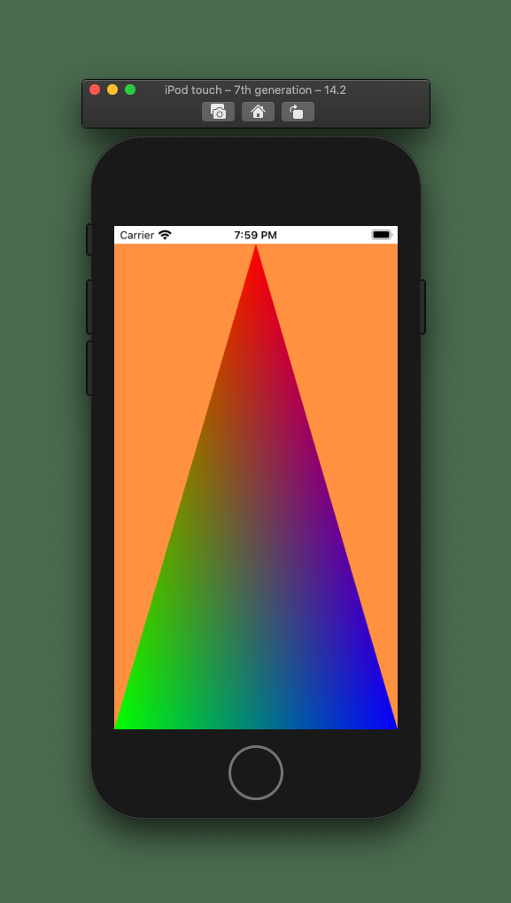

# MUI-POC



### SwiftUI
```swift
import MetalUI
import SwiftUI

struct ContentView: View {
    var body: some View {
        MetalView {
            BasicMetalView()
        }
    }
}

```

### BasicMetalView
```swift
import MetalUI
import MetalKit

class BasicMetalView: MTKView, MetalPresenting {
    var renderer: MetalRendering!
    
    required init() {
        super.init(frame: .zero, device: MTLCreateSystemDefaultDevice())
        configure(device: device)
    }
    
    required init(coder: NSCoder) {
        fatalError("init(coder:) has not been implemented")
    }
    
    func configureMTKView() {
        colorPixelFormat = .bgra8Unorm
        // Our clear color, can be set to any color
        clearColor = MTLClearColor(red: 1, green: 0.57, blue: 0.25, alpha: 1)
    }
    
    func renderer(forDevice device: MTLDevice) -> MetalRendering {
        BasicMetalRenderer(vertices: [
            MetalRenderingVertex(position: SIMD3(0,1,0), color: SIMD4(1,0,0,1)),
            MetalRenderingVertex(position: SIMD3(-1,-1,0), color: SIMD4(0,1,0,1)),
            MetalRenderingVertex(position: SIMD3(1,-1,0), color: SIMD4(0,0,1,1))
        ], device: device)
    }
}
```

### BasicMetalRenderer
```swift
import MetalUI
import MetalKit

final class BasicMetalRenderer: NSObject, MetalRendering {
    var commandQueue: MTLCommandQueue?
    var renderPipelineState: MTLRenderPipelineState?
    var vertexBuffer: MTLBuffer?
    
    var vertices: [MetalRenderingVertex] = []
    
    func createCommandQueue(device: MTLDevice) {
        commandQueue = device.makeCommandQueue()
    }
    
    func createPipelineState(
        withLibrary library: MTLLibrary?,
        forDevice device: MTLDevice
    ) {
        // Our vertex function name
        let vertexFunction = library?.makeFunction(name: "basic_vertex_function")
        // Our fragment function name
        let fragmentFunction = library?.makeFunction(name: "basic_fragment_function")
        // Create basic descriptor
        let renderPipelineDescriptor = MTLRenderPipelineDescriptor()
        // Attach the pixel format that si the same as the MetalView
        renderPipelineDescriptor.colorAttachments[0].pixelFormat = .bgra8Unorm
        // Attach the shader functions
        renderPipelineDescriptor.vertexFunction = vertexFunction
        renderPipelineDescriptor.fragmentFunction = fragmentFunction
        // Try to update the state of the renderPipeline
        do {
            renderPipelineState = try device.makeRenderPipelineState(descriptor: renderPipelineDescriptor)
        } catch {
            print(error.localizedDescription)
        }
    }
    
    func createBuffers(device: MTLDevice) {
        vertexBuffer = device.makeBuffer(bytes: vertices,
                                         length: MemoryLayout<MetalRenderingVertex>.stride * vertices.count,
                                         options: [])
    }
    
    func mtkView(_ view: MTKView, drawableSizeWillChange size: CGSize) {
        
    }
    
    func draw(in view: MTKView) {
        // Get the current drawable and descriptor
        guard let drawable = view.currentDrawable,
              let renderPassDescriptor = view.currentRenderPassDescriptor,
              let commandQueue = commandQueue,
              let renderPipelineState = renderPipelineState else {
            return
        }
        // Create a buffer from the commandQueue
        let commandBuffer = commandQueue.makeCommandBuffer()
        let commandEncoder = commandBuffer?.makeRenderCommandEncoder(descriptor: renderPassDescriptor)
        commandEncoder?.setRenderPipelineState(renderPipelineState)
        // Pass in the vertexBuffer into index 0
        commandEncoder?.setVertexBuffer(vertexBuffer, offset: 0, index: 0)
        // Draw primitive at vertextStart 0
        commandEncoder?.drawPrimitives(type: .triangle, vertexStart: 0, vertexCount: vertices.count)
        
        commandEncoder?.endEncoding()
        commandBuffer?.present(drawable)
        commandBuffer?.commit()
    }
}
```

### Shaders.metal
```metal
#include <metal_stdlib>
using namespace metal;

struct VertexIn {
    float3 position;
    float4 color;
};
struct VertexOut {
    float4 position [[ position ]];
    float4 color;
};
vertex VertexOut basic_vertex_function(const device VertexIn *vertices [[ buffer(0) ]],
                                       uint vertexID [[ vertex_id  ]]) {
    VertexOut vOut;
    vOut.position = float4(vertices[vertexID].position,1);
    vOut.color = vertices[vertexID].color;
    return vOut;
}
fragment float4 basic_fragment_function(VertexOut vIn [[ stage_in ]]) {
    return vIn.color;
}
```
